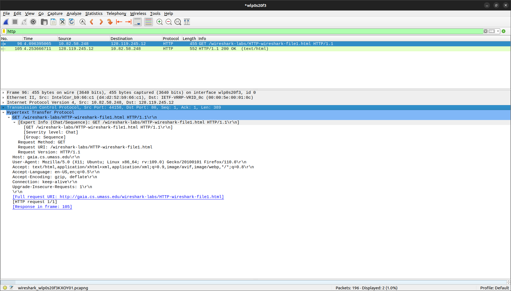
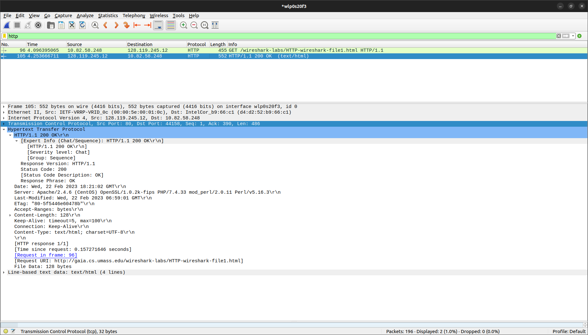
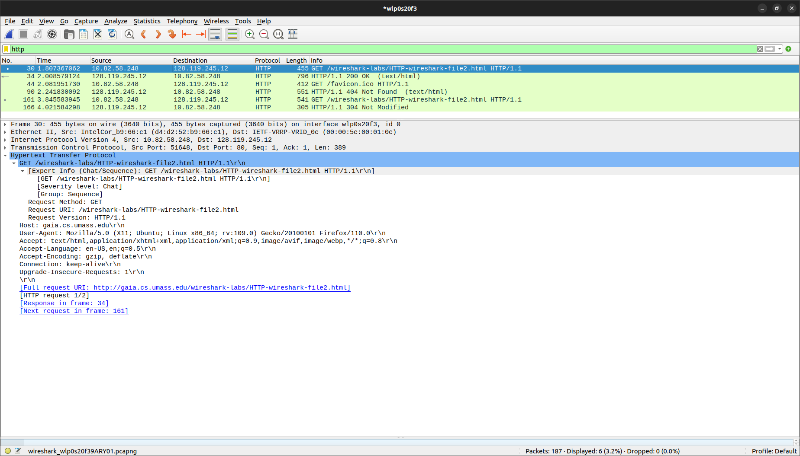
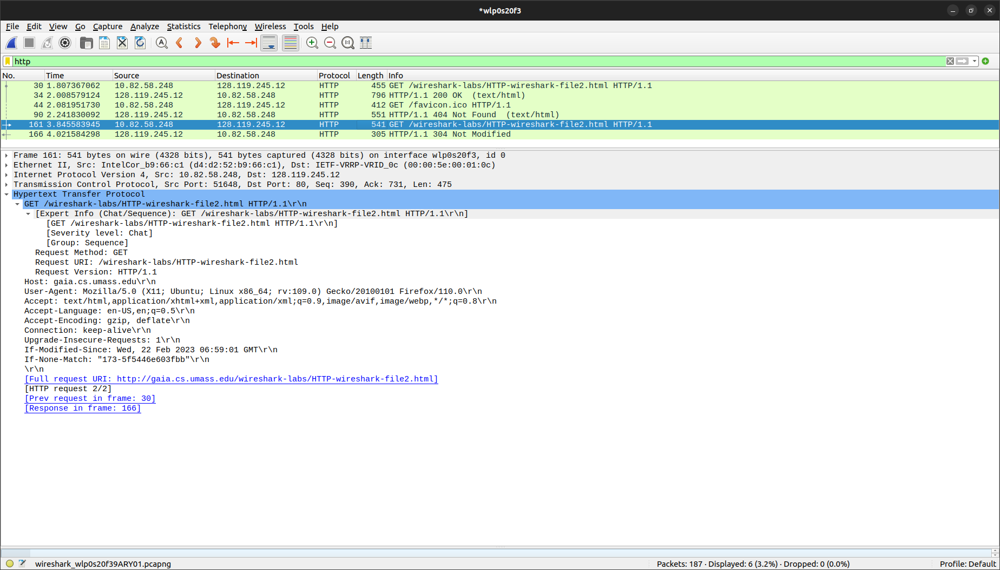
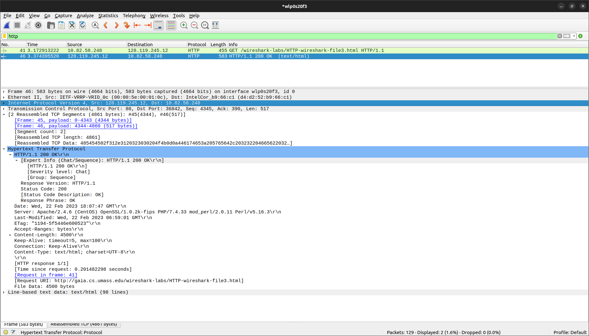
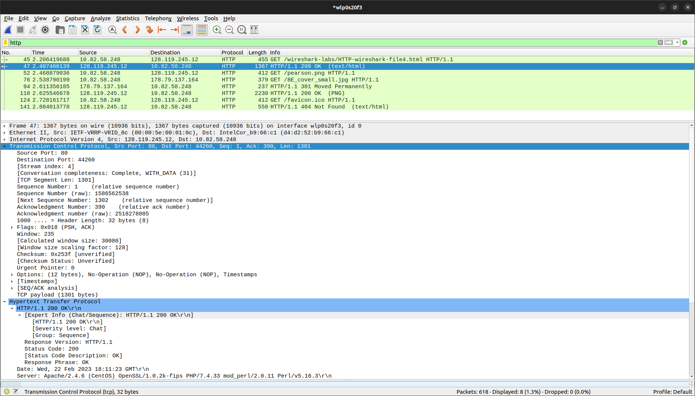
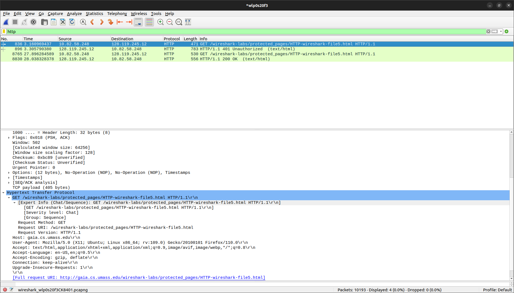
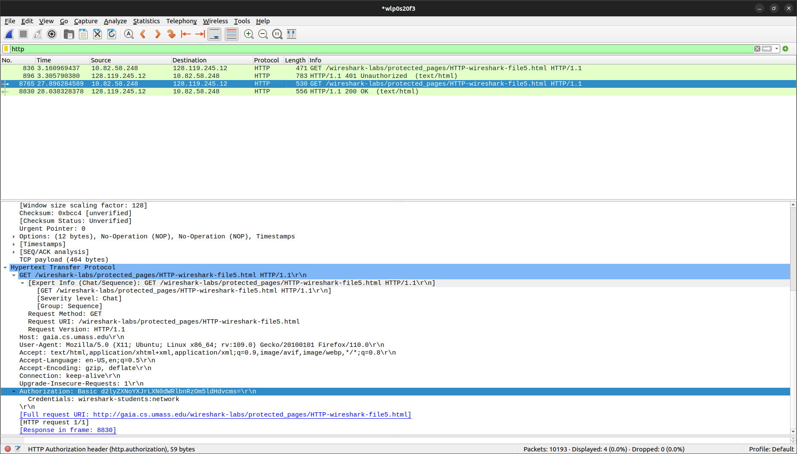

# WIRESHARK Домашка

## Задание 1

1. Использует ли ваш браузер HTTP версии 1.0 или 1.1? Какая версия HTTP работает на сервере? 
   > 1.1

2. Какие языки (если есть) ваш браузер может принимать? В захваченном сеансе какую еще информацию (если есть) браузер предоставляет серверу относительно пользователя/браузера?
   > Английский и русский языки принимает браузер
   > Кроме этого есть информация об ОС, о браузере, о принимаемых языках, принимаемом кодировании

3. Какой IP-адрес вашего компьютера? Какой адрес сервера gaia.cs.umass.edu? 
   > Src: 10.82.58.248
   > Dst: 128.119.245.12

4. Какой код состояния возвращается с сервера на ваш браузер? 
   > 200

5. Когда HTML-файл, который вы извлекаете, последний раз модифицировался на сервере? 
   > Sat, Wed, 22 Feb 2023 06:59:01 GMT

6. Сколько байтов контента возвращается вашему браузеру? 
   > 552

## Задание 2

1. Проверьте содержимое первого HTTP-запроса GET. Видите ли вы строку «IF-MODIFIEDSINCE» в HTTP GET?
   > Не содержит

2. Проверьте содержимое ответа сервера. Вернул ли сервер содержимое файла явно? Как вы это можете увидеть?
   > В ответе есть File Data, в Line-based text data содержится html страничка

3. Теперь проверьте содержимое второго HTTP-запроса GET (из вашего браузера на сторону сервера). Видите ли вы строку «IF-MODIFIED-SINCE:» в HTTP GET? Если да, то какая информация следует за заголовком «IF-MODIFIED-SINCE:»?
   > Появился IF-MODIFIED-SINCE
   > там записана дата последнего обновления сервера(видимо с прошлого запроса)

4. Какой код состояния HTTP и фраза возвращаются сервером в ответ на этот второй запрос HTTP GET? Вернул ли сервер явно содержимое файла? 
   > 304 - код возврата
   > Нет, не вернул

## Задание 3

1. Сколько сообщений HTTP GET отправил ваш браузер? Какой номер пакета в трассировке содержит сообщение GET? 
   > 1
   > 41 пакет

2.   Какой номер пакета в трассировке содержит код состояния и фразу, связанные с ответом на HTTP-запрос GET?
   > 46

3. Сколько сегментов TCP, содержащих данные, потребовалось для передачи одного HTTPответа?
   > 2

4. Есть ли в передаваемых данных какая-либо информация заголовка HTTP, связанная с сегментацией TCP? 
   > в заголовке нет информации о разбиении, но она присутствует в transmission control protocol

## Задание 4

1. Сколько HTTP GET запросов было отправлено вашим браузером? На какие Интернетадреса были отправлены эти GET-запросы?
   > 3 запроса:
   > http://gaia.cs.umass.edu/wireshark-labs/HTTP-wireshark-file4.html
   > http://gaia.cs.umass.edu/pearson.png
   > http://kurose.cslash.net/8E_cover_small.jpg
   

2. Можете ли вы сказать, загрузил ли ваш браузер два изображения последовательно или они были загружены с веб-сайтов параллельно? Объяснит
   > думаю, что параллельно, ведь загрузка первой картинки закончилась позже, чем началась загрузка второй картинке (это видно по номеру пакета)

## Задание 5

1. Каков ответ сервера (код состояния и фраза) в ответ на начальное HTTP-сообщение GET от вашего браузера?
   > 401 Unauthorized

2. Когда ваш браузер отправляет сообщение HTTP GET во второй раз, какое новое поле включается в сообщение HTTP GET? 
   > Authorization

