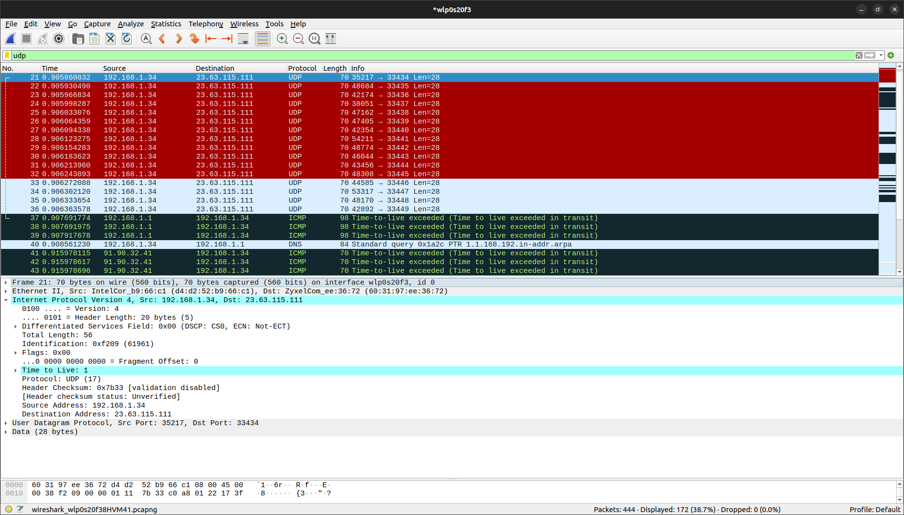

# Wireshark: Изучение трассы. Домашка

1. Выберите первое ICMP-сообщение эхо-запроса, отправленное вашим компьютером, и раскройте часть информации о пакете Internet Protocol в окне подробной информации. Каков IP-адрес вашего компьютера?
    >192.168.1.34

2. Найдите заголовок IP-пакета. Какое значение указано здесь в поле протокола верхнего уровня?
    > 17

3. Сколько байт в IP-заголовке? Сколько байт приходится на полезную нагрузку IPдейтаграммы?
    > в заголовке 20 байт, а на полезную нагрузку приходится 36 байт

4. Отсортируйте отслеженные пакеты по их исходному IP-адресу; для этого щелкните позаголовку столбца Source. Выберите первое сообщение эхо-запроса, отосланноевашим компьютером по протоколу ICMP, и раскройте раздел Internet Protocol.
    a. Какие поля IP-дейтаграммы всегда изменяются от одной дейтаграммы к следующей в рамках одной последовательности ICMP-сообщений, отсылаемых компьютером (последовательность – это все сообщения, которые отправляются до конечного хоста)?
    > изменяются checksum и identification
    
    b. Какие поля не меняются? Какие поля должны оставаться неизменными? Какие поля должны изменяться? (в рамках одного запуска утилиты)
    > Header length, Flags, Protocol, Total length и Destination address не меняются. TTL - изменятся, как и должно

    c. Как изменяется значение поля Identification IP-дейтаграммы с каждым последующим эхо-запросом? Есть ли какая-либо закономерность?
    > растет на 1

    

5. Какое значение содержится в поле Identification (Идентификация), а какое – в поле TTL (выберите какой-либо один пакет ICMP)?
    > Identification: 0x8577, TTL: 64
    

6. Остаются ли эти значения (Identification и TTL) неизменными во всех сообщениях протокола ICMP, где содержится информация об истечении предписанного времени жизни; рассмотрите только те из таких сообщений, которые поступили на компьютер с ближайшего (первого транзитного) маршрутизатора.
    > Identification растет, а TTL не меняется
    
    
    

7. Найдите серии откликов ICMP, в которых содержатся сообщения об истечении предписанного времени жизни (time-to-live exceeded). Выберите один из пакетов. Какое значение содержится в поле Identification (Идентификация), а какое – в поле TTL?
    > Identification: 0x6885, TTL: 249

8. Фрагментация. Остановите захват пакетов в Wireshark. Измените размер пакета Packet Size = 3500 байт. Снова запустите захват пакетов в Wireshark и перезапустите трассировку. (Для Unix заново запустите traceroute с длиной пакета 3500 байт). Найдите первое сообщение протокола ICMP с эхо-запросом, поступившее на ваш компьютер (с уже измененным размером пакета).

    a. Было ли это сообщение фрагментировано между двумя или более IPдейтаграммами? Если да, то сколько фрагментов было создано?
    > отсылает 3 фрагмента, а получает 1
    
    