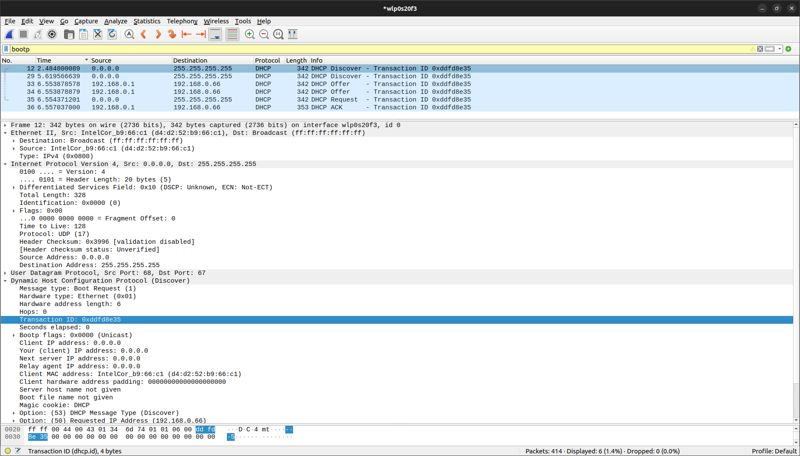

# Wireshark: DHCP. Домашка

1. Поверх какого протокола посылаются сообщения DHCP – UDP или TCP?
    > UDP

2. Каков адрес канального уровня (т.е., Ethernet-адрес) у вашего хоста?
    > d4:d2:52:b9:66:c1

3. Каковы значения Transaction-ID в наборе (Request/ACK) DHCP-сообщений? Опишите назначение поля Transaction-ID.
    > Transaction-ID: 0xddfd8e35. Показывает что относится к какому DHCP запросу

4. Хост использует DHCP-протокол, в частности, для получения IP-адреса. Но IP-адрес хоста остается неподтвержденным до завершения обмена DHCP сообщениями. Если IP-адрес не установлен до завершения обмена сообщениями, то какие значения используются в IPдейтаграммах при обмене этими сообщениями? Укажите исходный и конечный IP-адреса, передаваемые в инкапсулирующей IP-дейтаграмме DHCP сообщений
    >  исходный: 0.0.0.0, принимающий: 255.255.255.255.

5. Каков IP-адрес вашего DHCP-сервера?
    > 192.168.0.1

6. Объясните назначение срока аренды IP-адреса. Какова длительность срока аренды в вашем эксперименте?
    > Если срок не будет продлен, то по завершению даного периода ip адрес осободится. В моем случае это 2 часа

# Задачи 

## Задача 1

Вывод значения эффективности дискретного протокола ALOHA.
1. При наличии N активных узлов эффективность дискретного протокола ALOHA равна 𝑁𝑝(1–𝑝)^(N1)Найдите значение p,максимизирующее результат этого выражения.
    > $(Np(1-p)^{N-1})'_p = N((1-p)^{N-1} - (N-1)p(1-p)^{N-2}) = N(1-p)^{N-2}(1 - p - Np + p) = N(1-p)^{N-2}(1-Np)$
    > $N(1-p)^{N-2}(1-Np) = 0$ имеет 2 решения: $p_1 = \frac{1}{N}, p_2 = 1$. Заметим, что максимум достигается только при $p = \frac{1}{N}$

2. Воспользовавшись значением p, найденным в пункте (a), найдите эффективность дискретного протокола ALOHA, когда N стремится к бесконечности.
    > $\lim_{N\to\infty} N\frac{1}{N}(1-\frac{1}{N})^{N-1} = \lim_{N\to\infty} (1 - \frac{1}{N})^{N} \frac{1}{1 - \frac{1}{N}} =  \rightarrow \frac{1}{\exp}$