# Wireshark. Работа с DNS. Домашка

## Задание А

1. Выполните nslookup, чтобы получить IP-адрес какого-либо веб-сервера в Азии 
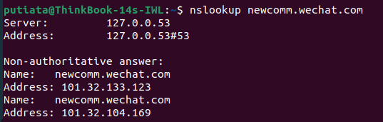
   > 101.32.133.123

2. Выполните nslookup, чтобы определить авторитетные DNS-серверы для какого-либо университета в Европе
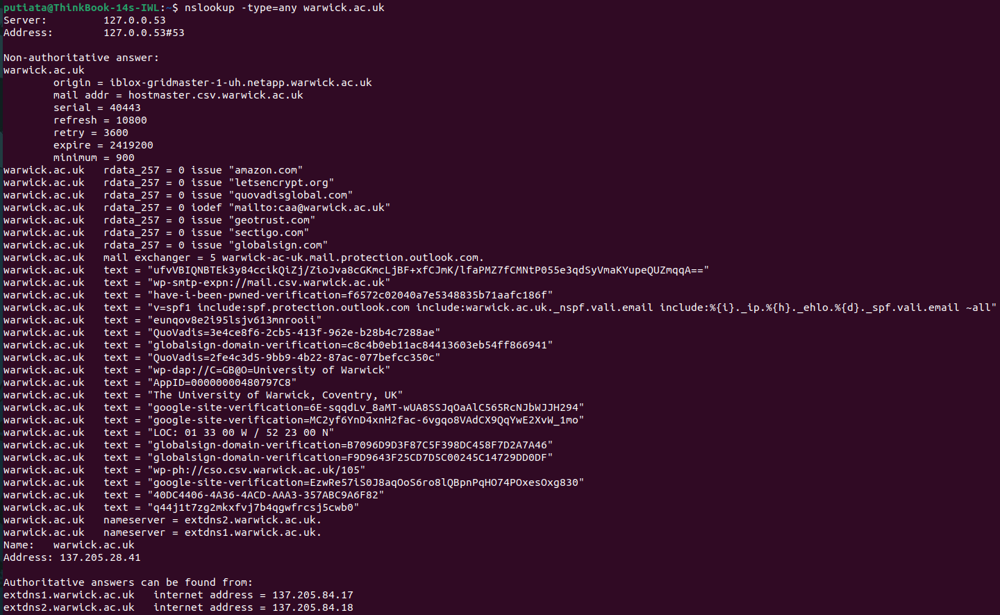
   > 137.205.84.17
   > 137.205.84.18

3. Используя nslookup, найдите веб-сервер, имеющий несколько IP-адресов. Сколько IPадресов имеет веб-сервер вашего учебного заведения? 
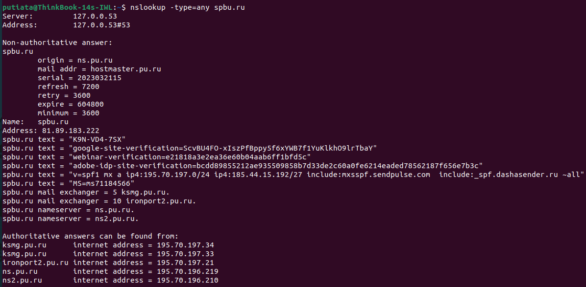
   > 5

## Задание Б

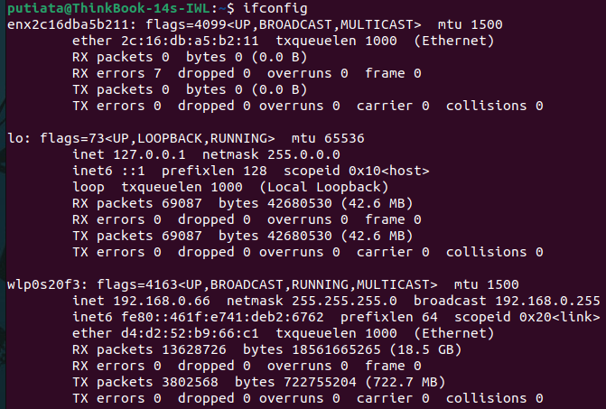

1. Найдите DNS-запрос и ответ на него. С использованием какого транспортного протокола они отправлены? 
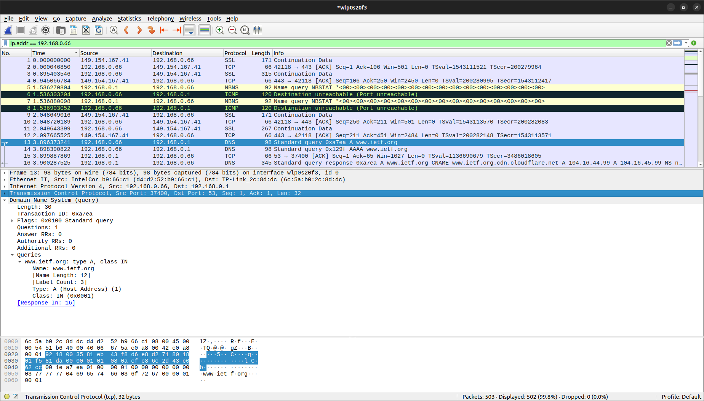
    > TCP

2. Какой порт назначения у запроса DNS? 
    > 53

3. На какой IP-адрес отправлен DNS-запрос? Используйте ipconfig для определения IP-адреса вашего локального DNS-сервера. Одинаковы ли эти два адреса?
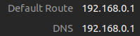
    > Да, одинаковые: 192.168.0.1

4. Проанализируйте сообщение-запрос DNS. Запись какого типа запрашивается? Содержатся ли в запросе какие-нибудь «ответы»?  
    > Тип A
    > Нет, не содержит

5. Проанализируйте ответное сообщение DNS. Сколько в нем «ответов»? Что содержится в каждом?
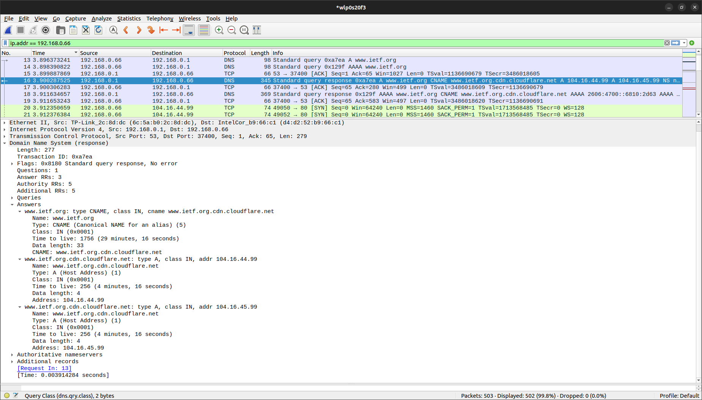
    > 3
    > Ответы содержат ip адреса, типы, классы, размер данных и время жизни пакета

6. Посмотрите на последующий TCP-пакет с флагом SYN, отправленный вашим компьютером. Соответствует ли IP-адрес назначения пакета с SYN одному из адресов, приведенных в ответном сообщении DNS? 
    > Да, совпадает: 104.16.44.19

7. Веб-страница содержит изображения. Выполняет ли хост новые запросы DNS перед загрузкой этих изображений? 
    > Второй dns запрос есть, но он похоже не связан с изображениями

## Задание В

1. Каков порт назначения в запросе DNS? Какой порт источника в DNS-ответе?
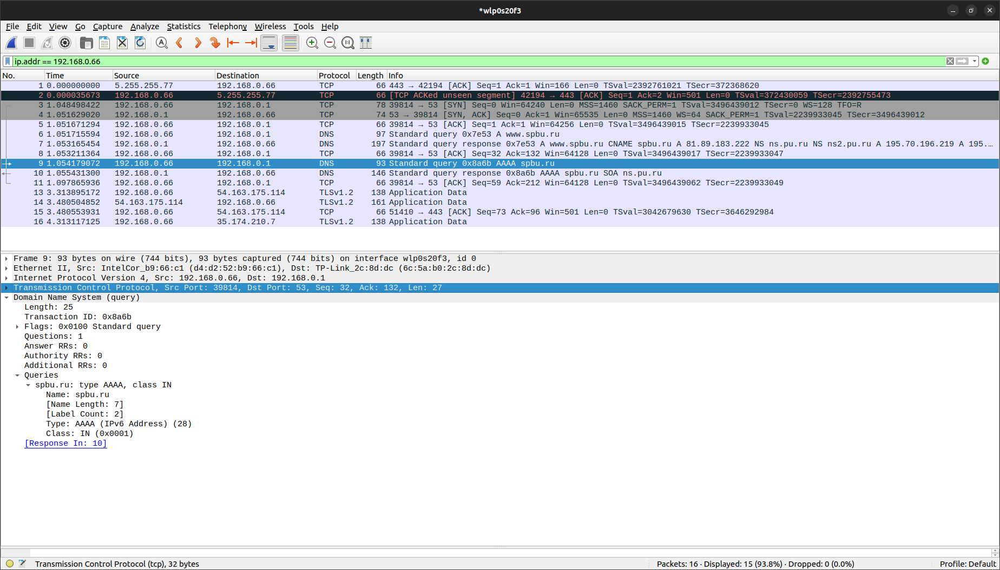
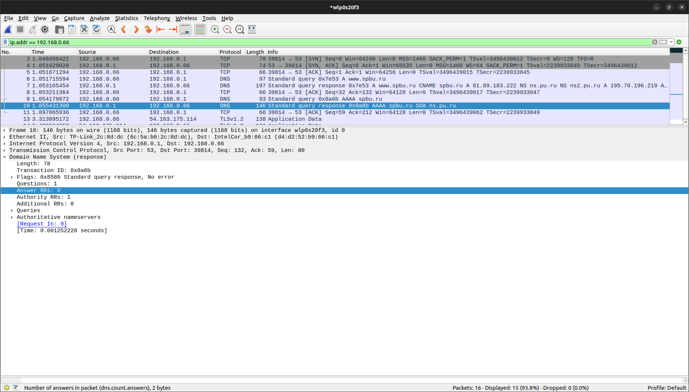
    > 53 порт и там, и там

2. На какой IP-адрес отправлен DNS-запрос? Совпадает ли он с адресом локального DNSсервера, установленного по умолчанию?
    > Да, совпадает: 192.168.0.1

3. Проанализируйте сообщение-запрос DNS. Запись какого типа запрашивается? Содержатся ли в запросе какие-нибудь «ответы»?
    > Типа AAAA, ответов нет

4. Проанализируйте ответное сообщение DNS. Сколько в нем «ответов»? Что содержится в каждом?
    > Как таковых ответов нет

## Задание Г

1. На какой IP-адрес отправлен DNS-запрос? Совпадает ли он с адресом локального DNSсервера, установленного по умолчанию?
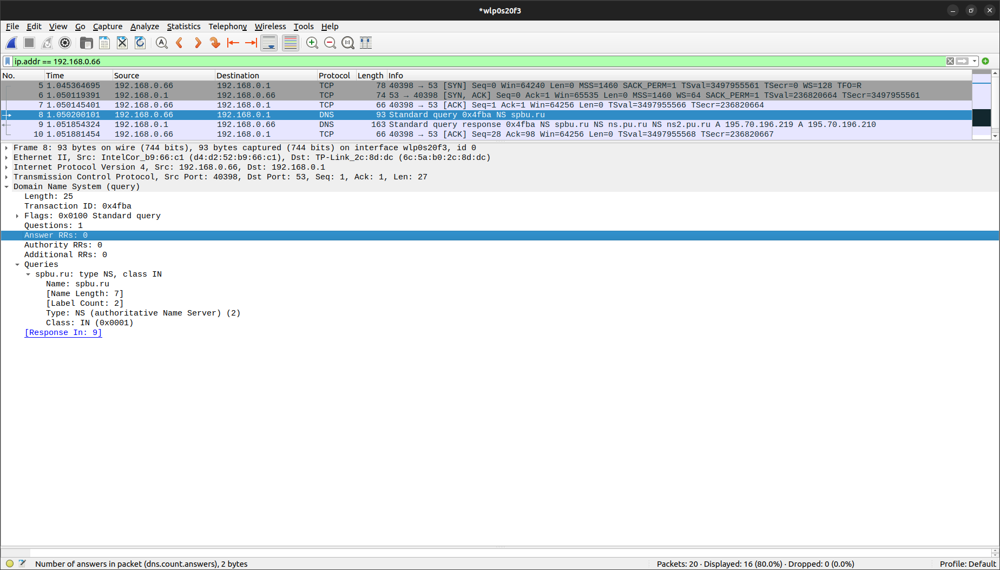
    > Да, совпадает: 192.168.0.1

2. Проанализируйте сообщение-запрос DNS. Запись какого типа запрашивается? Содержатся ли в запросе какие-нибудь «ответы»?
    > Типа NS
    > ответов нет

3. Проанализируйте ответное сообщение DNS. Имена каких DNS-серверов университета в нем содержатся? А есть ли их адреса в этом ответе? 
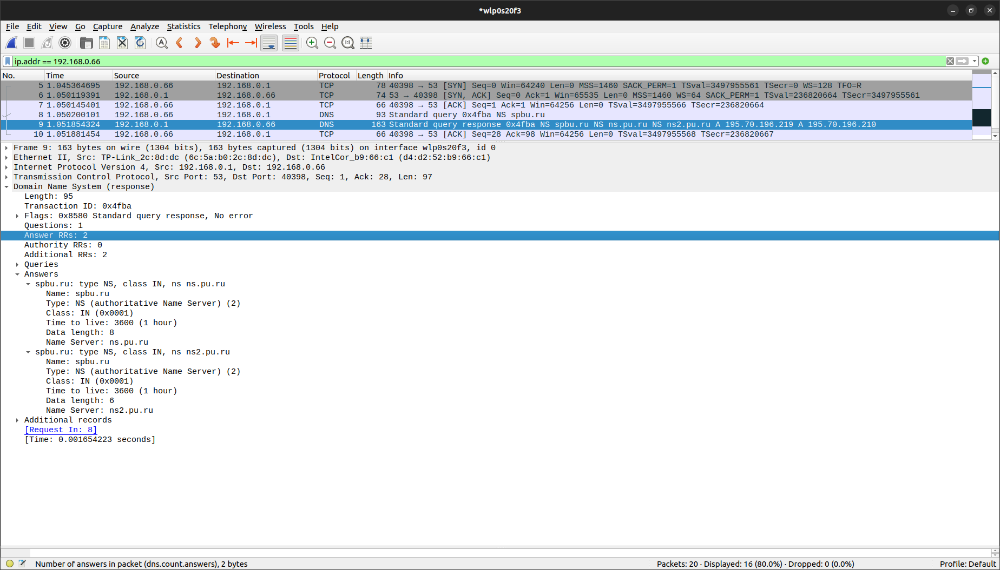
    > имена Name Server
    > адресов нет 

