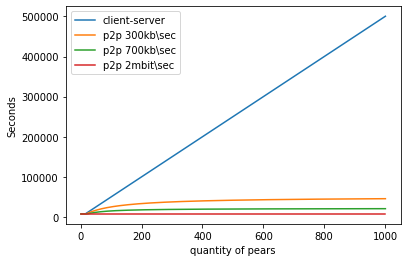

# Прикладной уровень. Домашка

## Задача 2

смотреть TASK2.ipynb

## Задача 3

1.  
    >$\frac{u_s}{N} \leq d_{min}$. Заметим, что тогда $\frac{N \cdot F}{u_s} \geq \frac{F}{d_{min}}$. 
    Узкое горлышко - скорость раздачи, тогда скорость упирается в $\frac{u_s}{N}$. Если взять все скорости по $\frac{u_s}{N}$, то время будет равно $\frac{F}{\frac{u_s}{N}} = \frac{N \cdot F}{u_s}$

2. 
    >$\frac{u_s}{N} \geq d_{min}$. Заметим, что тогда $\frac{N \cdot F}{u_s} \leq \frac{F}{d_{min}}$. 
    Узкое горлышко - скорость скачивания, тогда скорость упирается в $d_{min}$. Если взять все скорости по $d_{min}$, то время будет равно $\frac{F}{d_{min}}$

3. 
    >В зависимости от того что меньше - скорость скачивания или выгрузки, то одно из этих мест будет узким местом, затормаживающим систему. А оба этих случая мы разобрали. Тогда и правда будет максимум (скорость меньше, значит время больше)