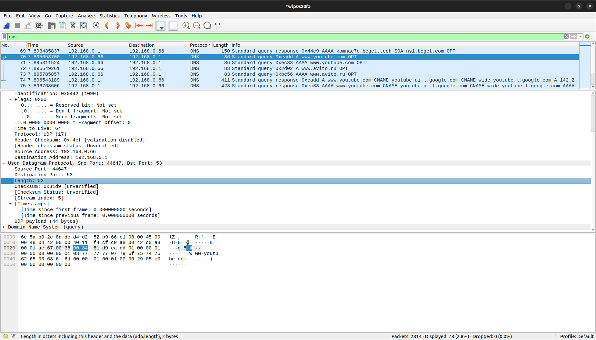

# Протокол UDP. Домашка

## Задание wireshark

1. Выберите один UDP-пакет. По этому пакету определите, сколько полей содержит UDP заголовок
    > 4 поля: порт получателя, порт отправителя, размер сообщения и проверочную сумму

2. Определите длину (в байтах) для каждого поля UDP-заголовка, обращаясь к отображаемой информации о содержимом полей в данном пакете. 
    > по 2 байта на поле - 8 байт

3. Значение в поле Length (Длина) – это длина чего? 
    > 52 байта - размер заголовков + UDP заголовка

4. Какое максимальное количество байт может быть включено в полезную нагрузку UDPпакета? 
    > 65535, так как длина Length 2 байта 

5. Чему равно максимально возможное значение номера порта отправителя? 
    > 65535, так как длина Destination Port 2 байта 

6. Какой номер протокола для протокола UDP? Дайте ответ и для шестнадцатеричной и десятеричной системы. Чтобы ответить на этот вопрос, вам необходимо заглянуть в поле Протокол в IP-дейтаграмме, содержащей UDP-сегмент. 
    > 17 (11 в шестнадцатиричной)

7. Проверьте UDP-пакет и ответный UDP-пакет, отправляемый вашим хостом. Определите отношение между номерами портов в двух пакетах. 
    > Source port and Destination port поменялись местами