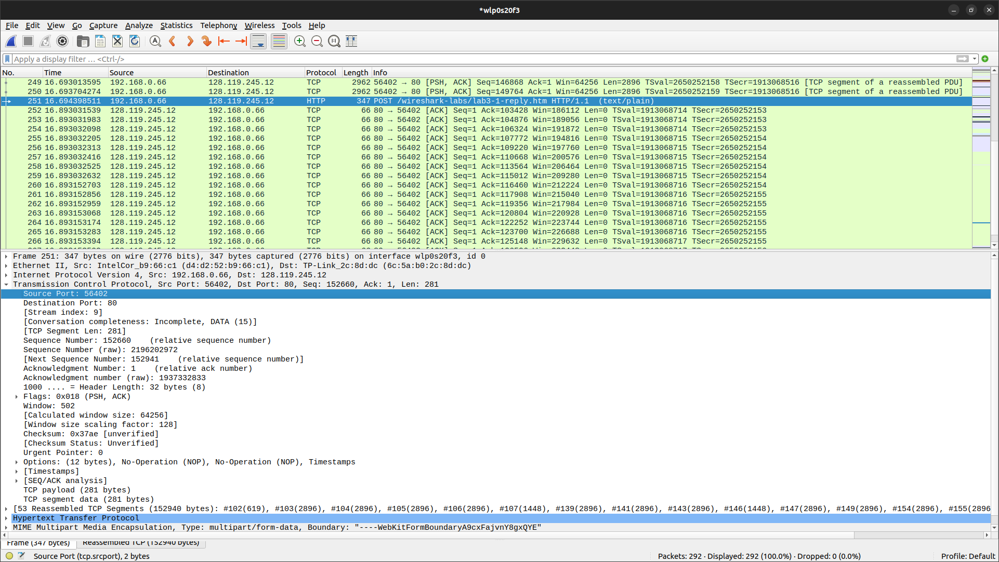
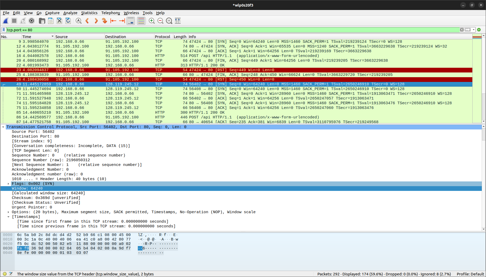
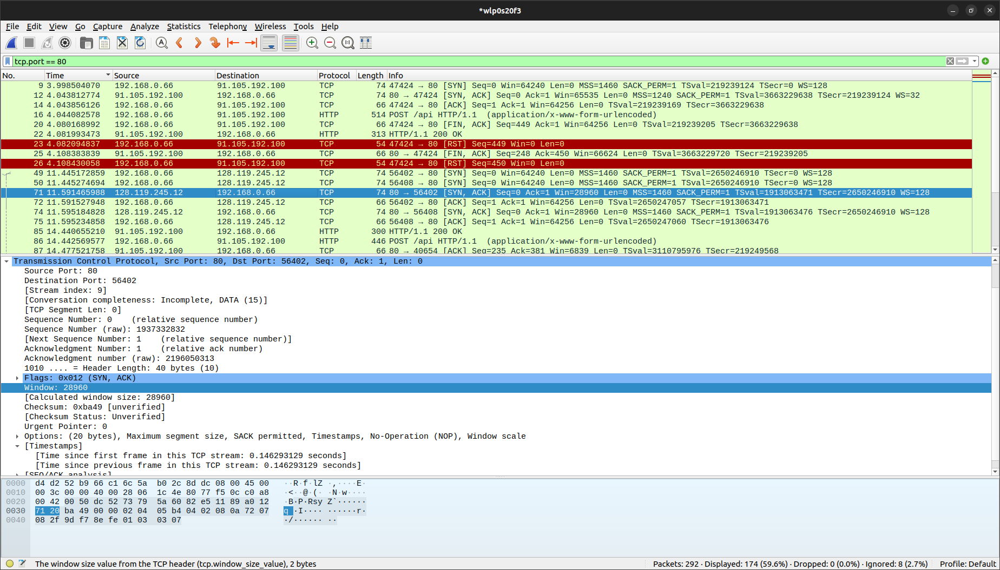
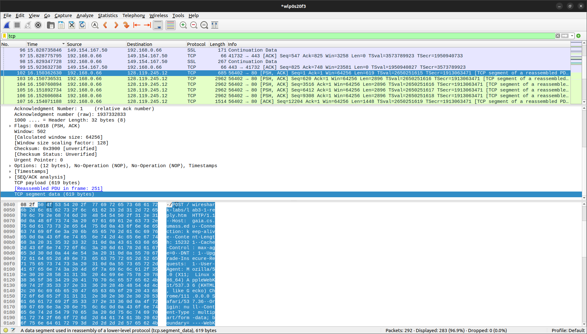
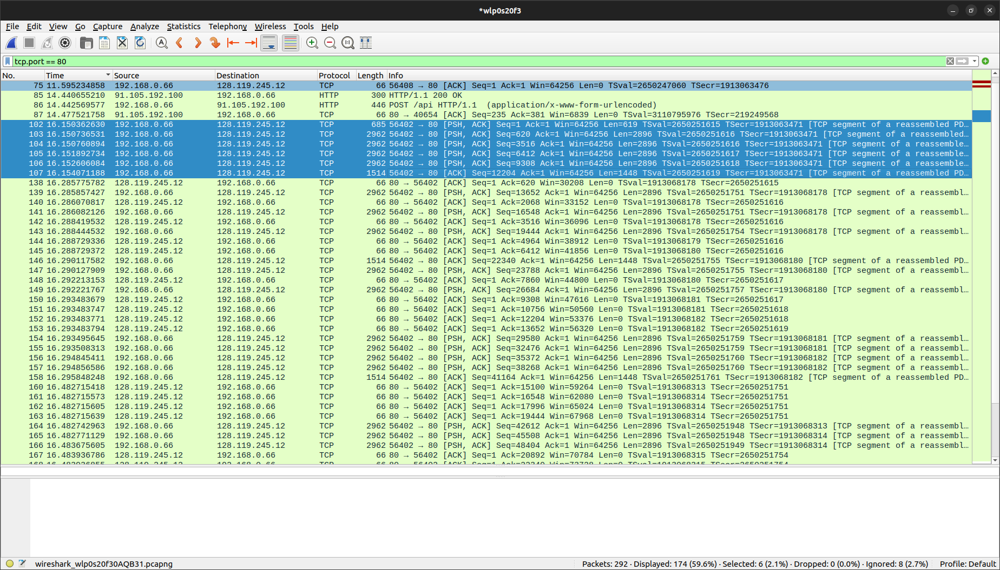
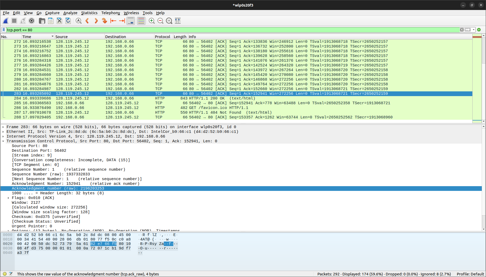
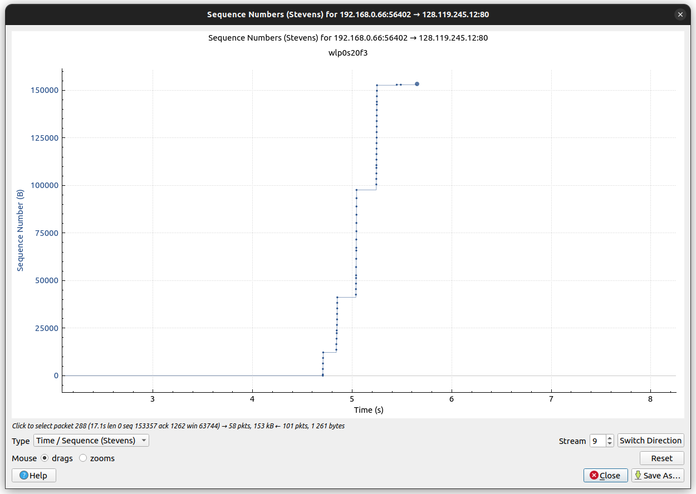

# Протокол TCP. Домашка

## Wireshark: TCP

1. Какой IP-адрес и номер порта TCP использует ваш компьютер (отправитель), передающийфайл серверу gaia.cs.umass.edu? Для ответа на вопрос, возможно, проще выбрать httpсообщение и рассмотреть информацию TCP-пакета, используемого для передачи этого http-сообщения, в окне деталей заголовка пакета
    
    > IP-адрес: 192.168.0.66
    > Порт: 56402

2. Каков IP-адрес у сервера gaia.cs.umass.edu? Каковы номера портов для отправки и приема TCP-сегментов этого соединения?
    > IP-адрес: 128.119.245.12
    > Порт: 80

3. Какой порядковый номер у SYN TCP-сегмента, который используется для установления TCP-соединения между компьютером клиента и сервером gaia.cs.umass.edu? Как определяется, что это именно SYN-сегмент?
    
    > Является SYN пакетом, т.к. установлен соответствующий флаг. Относительный порядковый номер - 0, абсолютный - 2196050312 

4. Какой порядковый номер у SYNACK-сегмента, отправленного сервером gaia.cs.umass.edu на компьютер клиента в ответ на SYN-сегмент? Какое значение хранится в поле подтверждения в SYNACK-сегменте? Как сервер gaia.cs.umass.edu определил это значение? Как определяется, что это именно SYNACK-сегмент?
    
    > Является SYNASK пакетом, т.к. установлены соответствующие флаги. Относительный порядковый номер - 0, абсолютный - 1937332832. Номер подтверждения равен 2196050313(порядковый номер отправителя + 1, считывание SYN флага)

5. Какой порядковый номер у TCP-сегмента, содержащего команду POST протокола HTTP? (для нахождения команды POST вам потребуется проникнуть внутрь поля содержимого пакета в нижней части окна Wireshark, чтобы найти сегмент, в поле DATA которого хранится значение POST)
    
    > Относительный порядковый номер 1, абсолютный порядковый - 2196050313

6. Рассмотрите TCP-сегмент, содержащий команду POST протокола HTTP, как первый TCPсегмент соединения. Какие порядковые номера у первых шести сегментов TCPсоединения (включая сегмент, содержащий команду POST протокола HTTP)? Когда был отправлен каждый сегмент? Когда был получен ACK-пакет для каждого сегмента? Покажите разницу между тем, когда каждый TCP-сегмент был отправлен и когда было получено каждое подтверждение, чему равно значение RTT для каждого из 6 сегментов?
    

    >   | Порядковый номера | Время отправление | Время получения | RTT(без скользящего среднего) |
    >   |--------------------------------|-------------------|-----------------|-----|
    >   | 1 | 16.150362630 | 16.285775782 | 0.135413152 |
    >   | 620 | 16.150736531 | 16.288419532 | 0.137683001 |
    >   | 3516 | 16.150760894 | 16.288729372 | 0.137968478 |
    >   | 6412 | 16.151892734 | 16.293483679 | 0.141590945 | 
    >   | 9308 | 16.152606084 | 16.293483771 | 0.140877687 |
    >   | 12204 | 16.154071188 | 16.293483794 | 0.139412606 |

7. Чему равна пропускная способность 
    
    > последний ask отчитывается о 152941 байте, и разница во времени с начальным запросом равна 0.742922462 сек. Тогда пропускная способность равна $\frac{152941}{0.742922462}$ $\approx$ 205864 байт/сек $\approx$ 205 КБ/сек

## 2. Wireshark: Работа с Time-Sequence-Graph (Stevens)

1. Используйте инструмент построения графиков Time-Sequence-Graph (Stevens), чтобы представить изменение порядковых номеров на временной шкале для сегментов, отправленных от клиента серверу gaia.cs.umass.edu.
    