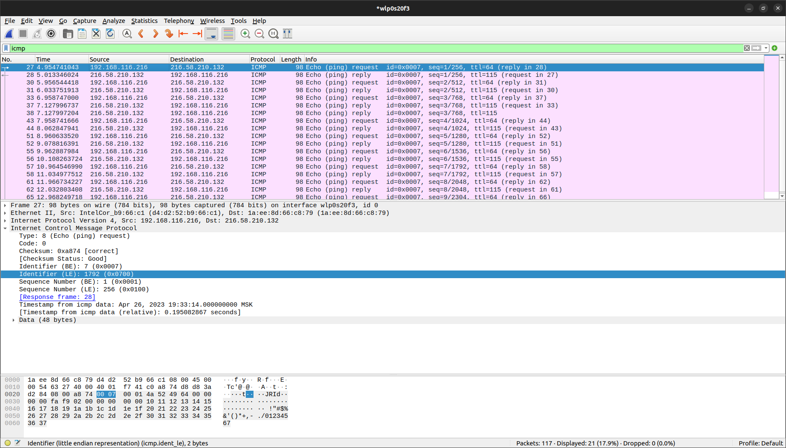
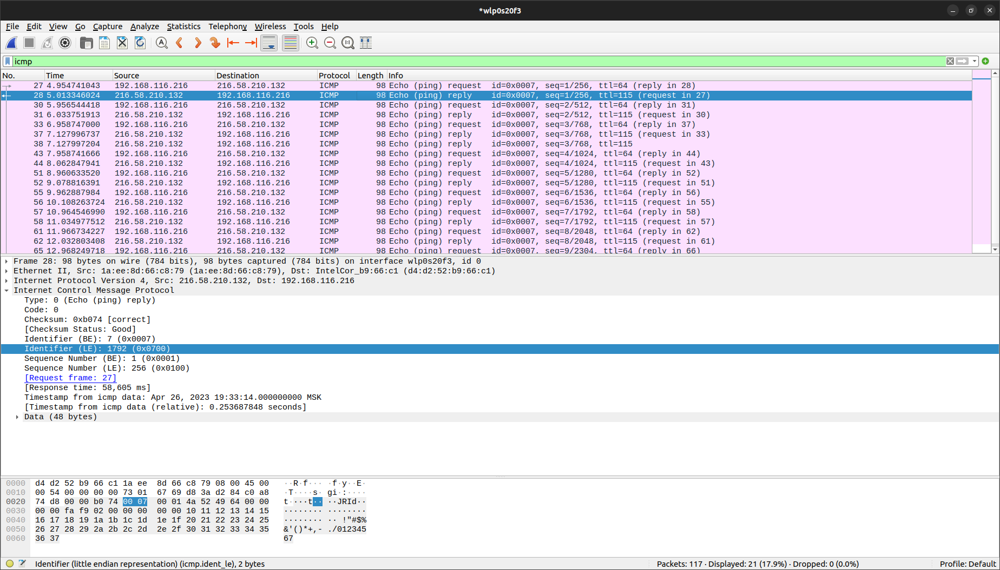

# Wireshark: ICMP. Домашка

## PING

1. Каков IP-адрес вашего хоста? Каков IP-адрес хоста назначения?
    > Src: 192.168.116.216, Dst: 216.58.210.132

2. Почему ICMP-пакет не обладает номерами исходного и конечного портов?
    >  

3. Рассмотрите один из ping-запросов, отправленных вашим хостом. Каковы ICMP-тип и кодовый номер этого пакета? Какие еще поля есть в этом ICMP-пакете? Сколько байт приходится на поля контрольной суммы, порядкового номера и идентификатора?
    > Type: 8(Echo (ping) request), Code: 0
    > Есть поля: Type, Code, Checksum, Indetifier, Sequence Number, Timestamp, Data
    > Выдеделено по 2 байта

4. Рассмотрите соответствующий ping-пакет, полученный в ответ на предыдущий. Каковы ICMP-тип и кодовый номер этого пакета? Какие еще поля есть в этом ICMP-пакете? Сколько байт приходится на поля контрольной суммы, порядкового номера и идентификатора?
    > Type: 0(Echo (ping) reply), Code: 0
    > Появляется поле Response Time, а остальные такие же
    > По 2 байта
    

## Traceroute

1. Рассмотрите ICMP-пакет с эхо-запросом на вашем скриншоте. Отличается ли он от ICMP-пакетов с ping-запросами из Задания 1 (Ping)? Если да – то как?
    > Пропало поле Timestamp

2. Рассмотрите на вашем скриншоте ICMP-пакет с сообщением об ошибке. В нем больше полей, чем в ICMP-пакете с эхо-запросом. Какая информация содержится в этих дополнительных полях?
    > Дополнительно появилось поле с информацией про IP: адреса отправителя и получателя, версия протокола, размер заголовка, ...

3. Рассмотрите три последних ICMP-пакета, полученных исходным хостом. Чем эти пакеты отличаются от ICMP-пакетов, сообщающих об ошибках? Чем объясняются такие отличия?
    > Эти пакеты успели дойти до истечения TTL, у них отсутствует поле с информацией по IP и их Type: 0

4. Есть ли такой канал, задержка в котором существенно превышает среднее значение? Можете ли вы, опираясь на имена маршрутизаторов, определить местоположение двух маршрутизаторов, расположенных на обоих концах этого канала? 
    > Можно выделить только переход из 108.170.250.146 (9) в 209.85.249.158 (10), но эти оба ip находятся в США, Моунтайн-Вью